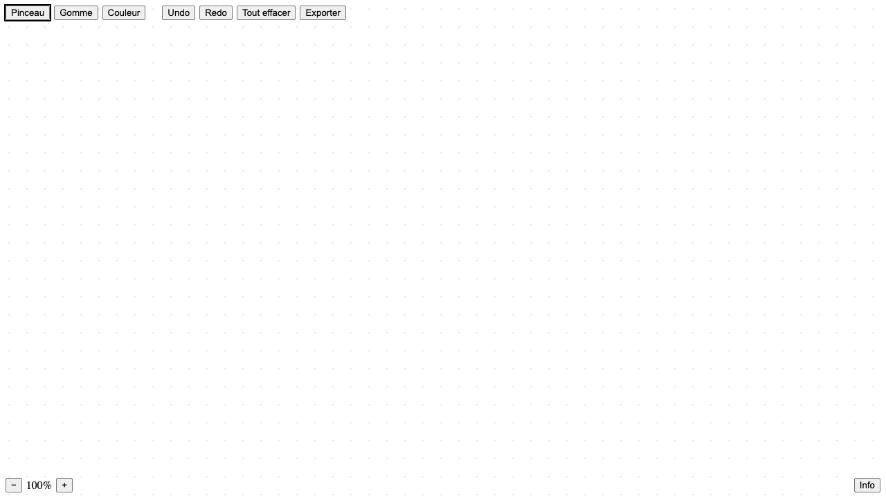

# Prompt 1 — 2026-06-08 23:10:51

## Prompt utilisateur (verbatim)

> analyse la demande de instructions-1.md et ignore le dossier old version. Réalise une
> application minimaliste sans rajouter d'outils en plus que ce que j'ai demandé. On passera
> au design de celle-ci par la suite mais d'abord faisons quelque chose de simple. Réalise un
> fichier en parallèle qui archive tous mes prompts que je te fais et inscrit les résultats que
> tu donnes toi avec à chaque fois une capture d'écran de où en est l'interface.
>
> (suivi de) au passage pour qu'on puisse bien voir tout ça tu peux me faire un lien public pour
> que je puisse voir mon projet publié sur un vrai url (app qui fonctionne) via github ? c'est
> aussi là qu'on fera tous les commits et poussages.

## Résultat

Application de dessin minimaliste créée (vanilla HTML/CSS/JS, sans framework ni design) avec
**uniquement** les fonctions demandées dans `instructions-1.md` :

- **Pinceau** (un seul style) + **Gomme**, chacun avec son **slider d'épaisseur qui s'ouvre à droite** du bouton.
- **Palette de 5 couleurs**, une seule sélection à la fois, s'ouvre à droite du bouton « Couleur ».
- **Undo / Redo**.
- **Tout effacer** en un seul clic (sans confirmation).
- **Exporter** le plan de travail en PNG (grille + dessin).
- **Zoom 50% → 200%** (bouton −/+ et libellé en bas à gauche).
- **Plan de travail plein écran** avec **grille en points**.
- Bouton **Info** (bas droite) ouvrant un **modal**.

Fichiers : `index.html` (accueil), `app.html`, `app.js`, `style.css` (positionnement uniquement).

Système d'archive mis en place : dossier `archive/`, un sous-dossier par requête
(`prompt-X_aammjjhhmmss`) avec `prompt.md` + `capture.png`. Capture générée via
`archive/capture.mjs` (Playwright + Chrome).

Publication : déploiement via **GitHub Pages** sur le dépôt
`walliser-chas-us-em-terroir/Drawered_Design-Interface`.

## Capture

