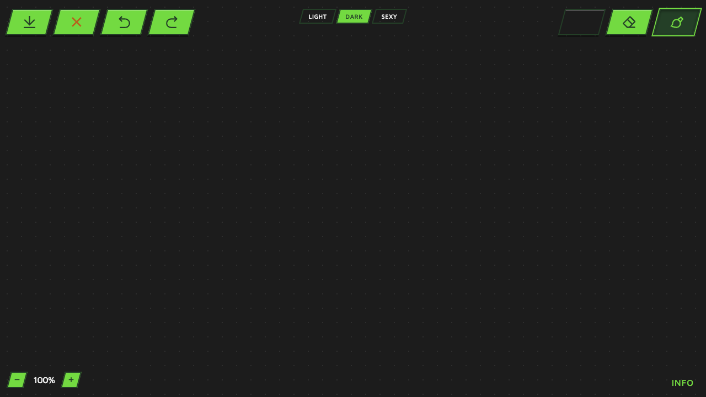

# Prompt 2 — 2026-06-09 00:14:37

## Prompt utilisateur (verbatim)

> /plan — analyse instruction-2.md

(+ réponses de cadrage : appliquer **tout le design d'un coup** ; **3 thèmes**
LIGHT/DARK/SEXY avec un sélecteur, DARK par défaut ; police logo **Elliot_Swonger** fournie
par l'utilisateur à la racine ; dossier `images/` renommé en `links/`.)

## Résultat

Application du **système de design Figma** (instructions-2.md) sur l'app et l'accueil, sans
modifier la logique de dessin :

- **Tokens couleur** : 3 thèmes (LIGHT / DARK / SEXY) via variables CSS sur `[data-theme]`,
  valeurs exactes d'instructions-2.md. **Sélecteur de thème** (haut centre), DARK par défaut,
  choix mémorisé en `localStorage`. SEXY recolore toute l'UI en rouge.
- **Polices** : `@font-face` **Elliot Swonger** (logo, `elliot_swonger.TTF`) + **Maven Pro**
  (Google Fonts). Classes typo `.logo` / `h1` / `h2` / `p` selon le spec.
- **Boutons parallélogrammes** (`skewX`, contre-skew du contenu) avec états
  (défaut / hover / sélectionné / désactivé) et **icônes SVG en `mask-image` base64** (paint,
  erase, save, undo, redo, delete) — recolorées selon le thème et l'état.
- **Pastille couleur** remplie de la couleur active ; **palette 5 couleurs** en flyout.
- **Slider d'épaisseur** restylé (piste verte + poignée parallélogramme).
- **Accueil** : logo Elliot Swonger, **bouton START** parallélogramme, galerie d'images
  teintées vert, fond thémé.
- **Modal Info** restylé.

Disposition fidèle aux maquettes : actions en haut-gauche (export, ×, undo, redo), outils en
haut-droite (couleur, gomme, pinceau), zoom en bas-gauche, INFO en bas-droite ; les panneaux
s'ouvrent vers l'intérieur du canvas.

Vérifié via Playwright : dessin, changement de couleur, slider, bascule de thème et
persistance — tout fonctionne. Fonctions de dessin (undo/redo, effacer, export, zoom 50–200 %)
inchangées.

Fichiers : `style.css` (réécriture), `app.html`, `index.html`, `app.js` (ajouts thème/couleur/grille).

## Capture (app, thème DARK)

