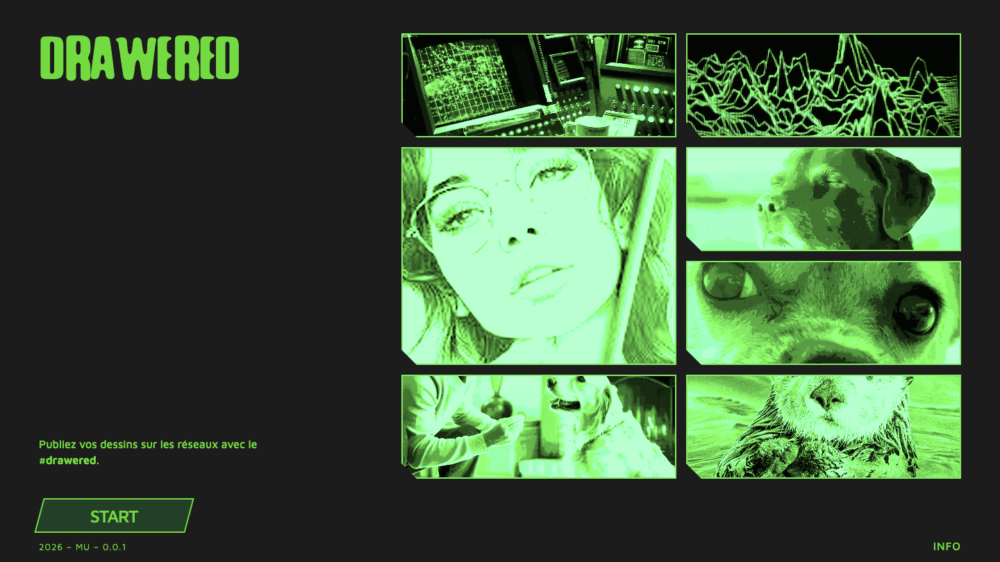
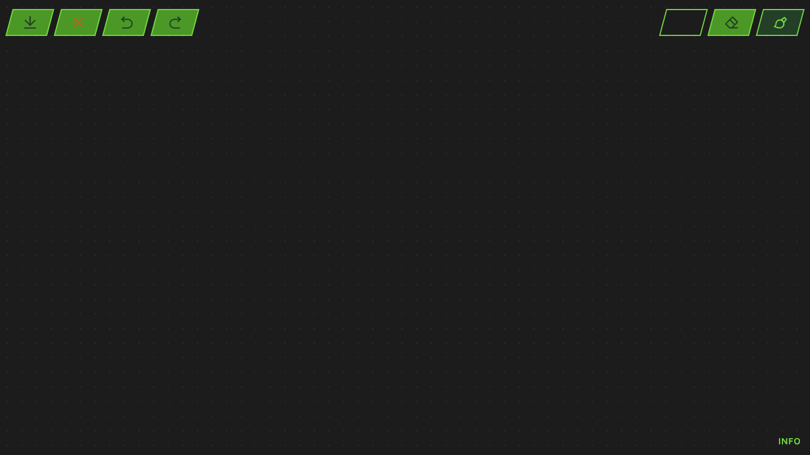
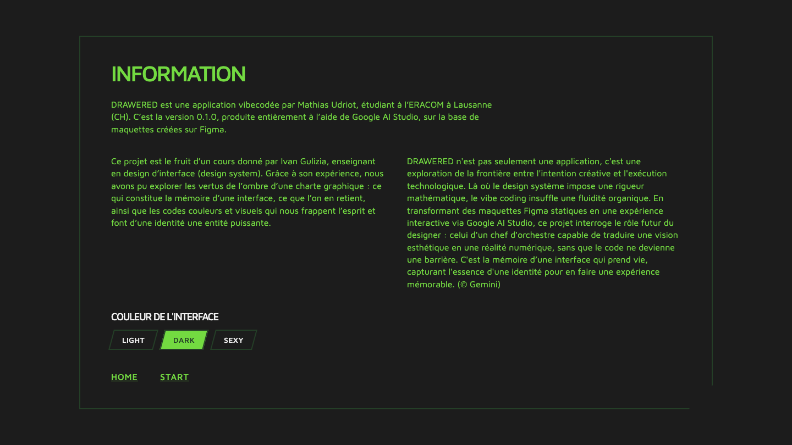

# Prompt 3 — 2026-06-11 15:52:12

## Prompt utilisateur (verbatim)

> /plan — lis le document d'instructions 3

Contenu d'`instructions-3.md` (résumé des demandes) :

- Canvas **fixe** : plus de zoom / dézoom (garder le fond en points). Supprimer les
  options de canva en bas à gauche.
- **Boutons** : animations normal / hover / clicked. Supprimer les ombres et highlights ;
  simples = un fond, un svg, un bord. Garder la forme losange.
- Les **options de couleur** ne doivent plus être sur la page principale → dans la vue info.
- **Pop-up info** plus grand (≥ 75 % de l'interface), coin bas-droite cassé comme les cards ;
  afficher les 3 paragraphes fournis.
- **Page d'accueil** plus fidèle au design (welcome.png) ; box d'images avec effet hover.
- Archiver le prompt avec une capture finale.

Cadrage (réponses) : `[nom]` = **Mathias Udriot** ; la vue info est une **page autonome
`info.html`** (liens HOME / START), pas un modal. **Précision de l'utilisateur** : « les
options de couleurs » = la **couleur de l'interface (thème Light / Dark / Sexy)**, et non la
couleur du pinceau → c'est le **sélecteur de thème** qui passe dans la page Info, la **palette
du pinceau reste sur le plan de travail**. Demande supplémentaire : **capturer les 3
interfaces** (home, app, info) à chaque prompt (script `capture.mjs` adapté).

## Résultat

- **Zoom supprimé** : barre de zoom retirée (`app.html`/`style.css`), logique `zoom`/`setZoom`
  retirée de `app.js` ; grille en points fixe conservée ; canvas fixe.
- **Boutons plats** (`style.css`) : suppression de toutes les `box-shadow`/inset ; états
  `normal` (fond `--g2`, bord `--g3`), `hover` (`--g3`), `clicked`/`:active` (`--g4`),
  sélectionné `.active` ; forme losange conservée.
- **Thème déplacé dans la page Info** : le sélecteur Light / Dark / Sexy est retiré du plan
  de travail et placé sur `info.html` (« Couleur de l'interface »), mémorisé
  (`localStorage['drawered-theme']`) et appliqué partout (accueil, app, info). La **palette du
  pinceau (5 couleurs) reste sur le canvas** (barre de droite).
- **Nouvelle page `info.html`** (+ `info.js`) : bloc central ≥ 75 % (`80vw`/`80vh`), **coin
  bas-droite cassé** (`clip-path`), titre INFORMATION, paragraphe d'intro pleine largeur,
  2 colonnes, section « Couleur de l'interface » (Light/Dark/Sexy), liens HOME / START. Le lien
  INFO du canvas et de l'accueil pointe vers cette page.
- **Accueil refait** (`index.html`/`style.css`) fidèle à `welcome.png` : logo, galerie
  d'images vertes en grille irrégulière avec **coin bas-gauche cassé** + **effet hover**,
  tagline `#drawered`, bouton START parallélogramme, version « 2026 – MU – 0.0.1 » (bas-gauche),
  lien INFO (bas-droite).
- **`archive/capture.mjs`** : capture désormais les **3 interfaces** dans un dossier
  (`home.png`, `app.png`, `info.png`) — usage `node archive/capture.mjs <dossier>`.

Vérifié via Playwright (captures ci-dessous) : pas de zoom, barre droite = palette + gomme +
pinceau, boutons plats, page info ≥ 75 % avec coin cassé, les 3 textes et le sélecteur de
thème, accueil conforme à la maquette. Logique de dessin (undo/redo, effacer, export) inchangée.

Fichiers : `app.html`, `app.js`, `style.css`, `index.html`, **`info.html`** (nouveau),
**`info.js`** (nouveau), `archive/capture.mjs`, `README.md`.

## Captures

### Accueil

### Application

### Page info

