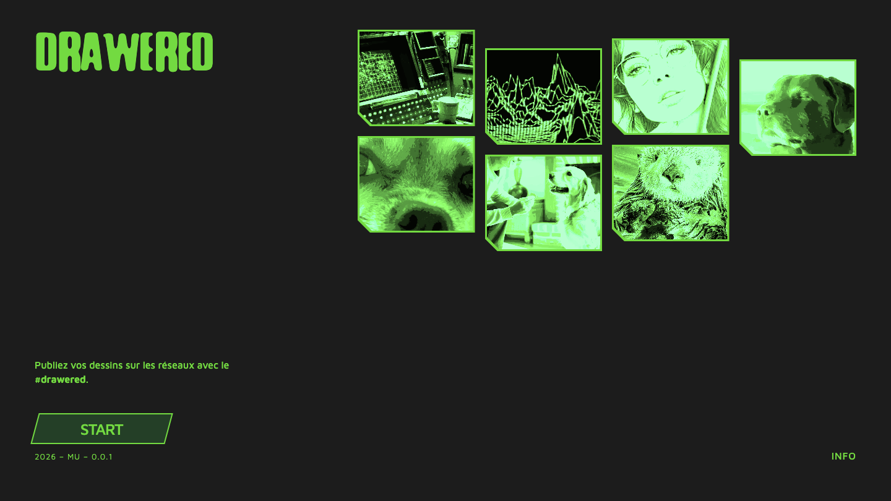
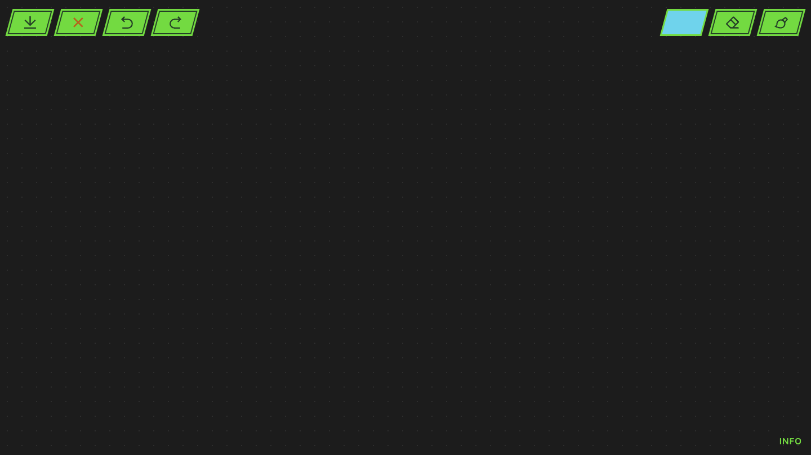
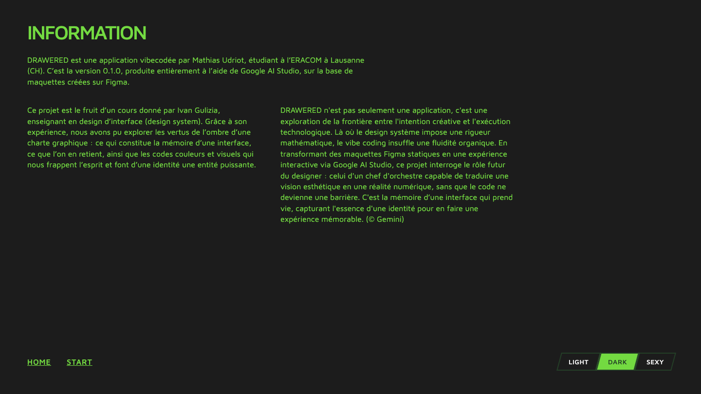

# Prompt 4 — 2026-06-11 17:48:35

## Prompt utilisateur (verbatim)

> /plan — lis les instructions 4 qui sont des corrections

Contenu d'`instructions-4.md` (corrections demandées) :

- **Boutons** : reproduire fidèlement le **double contour** du design Figma (un double bord
  apparaissait de façon incohérente) ; respecter exactement les états et couleurs
  (réf. `exemple-border-button.png`).
- **Palette de dessin** : pas de couleur sombre/claire, **ni noir ni blanc** (= couleur du fond).
- **Page info** : devenue une page à part → **plus de forme pop-up**, prend toute la page
  (cf. Figma) ; **pas de bordure verte**, **plus de coin cassé** ; mettre **HOME START LIGHT
  DARK SEXY sur une seule ligne en bas** (home/start à gauche collés, modes à droite collés) ;
  ne pas écrire « Couleur de l'interface ».
- **Mode SEXY** : version/filtre **rouge** sur les photos.
- **Accueil** : les coins cassés doivent **garder la bordure sur tout le contour** ; images
  **même format** ; grille décalée « qui casse les codes ».
- **Sliders + couleurs (très important)** : nouveau type de slider (component Figma
  6011-51254) — **7 cases d'épaisseur** (1px→60px, paliers intermédiaires libres) + **barre
  continue** dessous ; clic gomme/pinceau ouvre le slider **à droite** de l'outil, l'autre
  outil passe à la fin ; les cases ont la **même hauteur** que les boutons (réf.
  `detail-opened-draw.png`). Bouton couleur → **4 couleurs fixes** (réf.
  `detail-opened coulours.png`) ; choisir referme en une pastille et change la couleur du
  bouton. **Couleurs et épaisseur jamais ouverts en même temps.**
- Archivage final avec captures des 3 pages.

Cadrage (réponses) : couleur de dessin par défaut = **cyan** ; galerie d'accueil = **cases
identiques décalées**, au plus proche du Figma.

## Résultat

- **Boutons à double contour** (`style.css`) : fond vert (G3) + **cadre intérieur foncé** (G4)
  via `::before`, cohérent sur tous les boutons ; appui (`:active`) = inversion momentanée ;
  pastille couleur = contour vert autour de la couleur.
- **Refonte slider + couleurs** (`app.html`/`app.js`/`style.css`) : la barre de droite est
  reconstruite par JS selon `panelMode` (`none`/`colors`/`size`, un seul ouvert à la fois,
  alignée à droite → l'expansion grandit vers la gauche).
  - **Épaisseur** : 7 cases-losanges (1,10,20,30,40,50,60 px), remplies jusqu'à la valeur
    courante, + **barre continue** (curseur rond) **sous les cases** ; clic pinceau → cases à
    sa droite, clic gomme → cases entre gomme et pinceau (pinceau renvoyé à la fin).
  - **Couleurs** : `COLORS = rouge/jaune/magenta/cyan` (ni noir/blanc), défaut **cyan** ; le
    bouton couleur déplie 4 pastilles ; choisir referme et recolore le bouton.
- **Page info pleine page** (`info.html`/`style.css`) : `.info-page` sans bordure ni coin
  cassé ; bas sur une ligne → HOME/START à gauche, **LIGHT/DARK/SEXY** (segmenté) à droite ;
  suppression du titre « Couleur de l'interface ».
- **Mode SEXY** : filtre **rouge** sur `.frame img` quand `data-theme='sexy'`.
- **Accueil** (`index.html`/`style.css`) : chaque image enveloppée dans un `.frame` (fond vert
  + `clip-path` coin cassé) avec l'`img` en retrait de 3 px → **bordure verte sur tout le
  contour, y compris la diagonale du coin cassé** ; **cases identiques** disposées en grille
  **décalée** ; effet hover conservé.

Vérifié via Playwright (captures ci-dessous + états slider/couleurs ouverts) : slider et
palette conformes aux maquettes, exclusivité respectée, double contour cohérent, info pleine
page, mode sexy rouge sur les photos, bordure complète sur les coins cassés. Dessin
(undo/redo, effacer, export) inchangé.

Fichiers : `app.html`, `app.js`, `style.css`, `info.html`, `index.html`, `README.md`.

## Captures

### Accueil

### Application

### Page info

