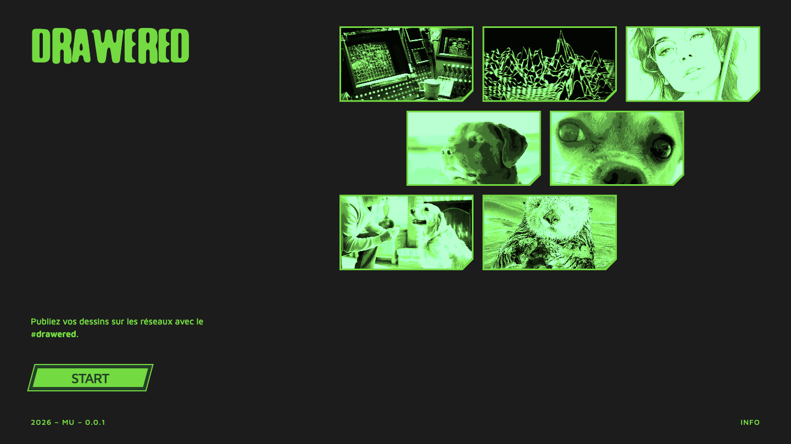
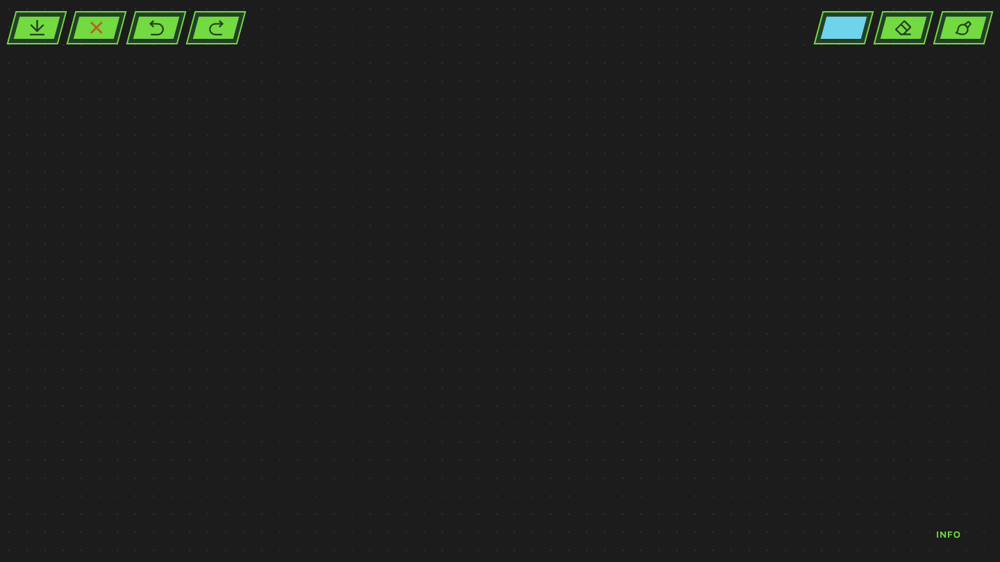
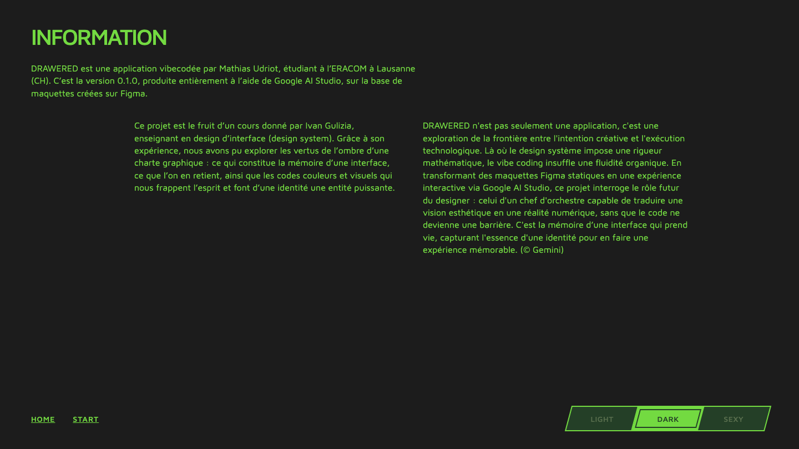

# Prompt 5 — 2026-06-12 08:18:24

## Prompt utilisateur (verbatim)

> /plan — lis les instructions-5.md et fais moi un /plan

Contenu d'`instructions-5.md` (corrections demandées) :

**Global**
- Crédits « 2026 – MU – 0.0.1 », bouton info, boutons home/start et choix light/dark/sexy
  **alignés en bas au même niveau** sur chaque page, sans différence entre les pages.
- **Tous les boutons** doivent avoir le **même style** (réf. `links/interface/bouton-style/`
  avec les états en nom de fichier) — copie exacte des couleurs d'état, y compris le bouton
  START. Tokens couleur fournis (déjà en variables CSS).

**Accueil**
- « 2026 – MU – 0.0.1 » avec la **même police que « info »**.
- Le bouton **START** doit avoir le **même style que les boutons icône** d'app.html.
- Les **coins cassés** sont du mauvais côté → les mettre **à droite**.
- Images **plus grandes**, occupant plus la **droite** (réf. Figma 4003-255 / `welcome.png`).
- Cards images **16:9**, **3 lignes** non alignées verticalement, **comme des briques** (1/2 décalage).

**App**
- Les aperçus d'épaisseur doivent représenter des **épaisseurs (traits arrondis)**, pas des ronds.
- Le sélecteur de couleurs doit avoir un **double contour** (rim G3 + bande G4) comme les autres boutons.

**Info**
- **Décaler les deux paragraphes du bas vers la droite** (cf. `info.png`).
- **Tab-bar** pour changer de mode couleur (réf. Figma node 106-39 / `tab-bar-exemple/`) :
  double contour, hover fonctionnel, et **effet de glissement** de la pastille active entre les modes.

## Décisions de cadrage

- Barre du bas : **aligner seulement** (chaque page garde ses éléments, même niveau bas + même
  style) ; la **tab-bar de thème reste sur la page Info**.

## Résultat

- **Style de bouton unique** (`style.css`) : 3 bandes = rim vif **G3** + bande foncée **G4** +
  fond **G3** ; `hover` → rim/bande **olive G1** ; `clicked` → fond **vert moyen G2**. Appliqué à
  tous les `.btn`, à `.btn--color` (double contour autour de la couleur), `.btn--danger` et au
  bouton **START** (`.start-link`).
- **App** : aperçus d'épaisseur = **traits horizontaux arrondis** (hauteur plafonnée, barre
  élargie), plus de ronds.
- **Tab-bar de thème** (`info.html`/`info.js`/`style.css`) : conteneur losange fond G4 + rim G3,
  3 onglets séparés par des traits G3, **pastille active à double contour qui glisse**
  (`translateX` + transition), hover d'un onglet inactif en **vert moyen G2**, thème persisté.
- **Info** : 2 colonnes **décalées vers la droite** (`margin-left`).
- **Accueil** : galerie **16:9 sur 3 lignes en briques** (lignes paires décalées d'½ carte),
  images **plus grandes / à droite**, **coin cassé à droite** avec bordure verte complète ;
  filtre **rouge** des photos en mode sexy conservé.
- **Barre du bas alignée** (même niveau `bottom:32px` + même style Maven Pro) sur home (crédits +
  info), app (info), info (home/start + tab-bar) ; crédits à la **même police que info**.

Vérifié via Playwright (home, app slider ouvert, info dark/light, accueil sexy) : boutons fidèles
aux états `bouton-style/*`, tab-bar qui glisse + hover, galerie 16:9 briques, coins à droite,
barre du bas alignée. Dessin (undo/redo/effacer/export) inchangé.

Fichiers : `style.css`, `index.html`, `info.html`, `info.js`, `app.js`, `README.md`.

## Captures

### Accueil

### Application

### Page info

