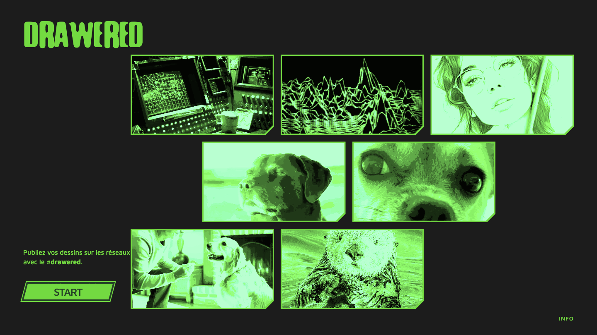
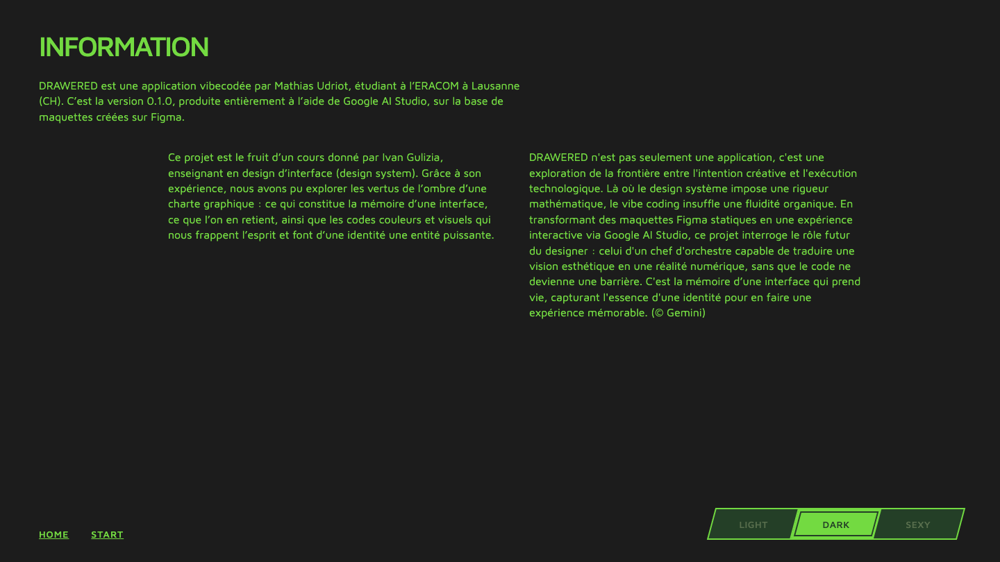

# Prompt 6 — 2026-06-12 08:35:54

## Prompt utilisateur (verbatim)

> /plan — et lis instructions-6.md  (puis : « use auto mode but add l'archivage à la fin
> dans le dossier archive avec les captures et le résumé du prompt »)

Contenu d'`instructions/instructions-6.md` (ajustements demandés) :

**Bouton**
- L'épaisseur du contour vert clair est trop épaisse → l'amincir pour que le vert clair et le
  vert foncé soient de la **même épaisseur**.

**Info / tab-bar**
- Top : il manque un **contour intérieur sur l'effet de hover**.

**Global**
- **Harmoniser les épaisseurs** entre la tab-bar et les boutons.
- Entre les pages, les éléments de footer (et les modes de couleur) doivent être à la **même
  hauteur, alignés en bas (pas centrés)**.

**Welcome**
- Pas de **zoom** au survol des images → seulement augmenter la **luminosité** (comme déjà fait).
- **Garder le contour même au hover**.
- La grille d'images doit être **plus grande en hauteur** : occuper **au moins 75 %** de la
  hauteur visuellement (actuellement elle ne prend que le haut de l'écran).

## Résultat (`style.css`)

- **Boutons** : `::before { inset: 6px → 4px }` (`.btn` et `.start-link`) → bande foncée G4 = 2px,
  **égale** au rim clair G3 (2px).
- **Tab-bar** : ajout d'un **contour intérieur** (G4, 2px) sur le **hover** d'un onglet inactif,
  comme la pastille active ; épaisseurs **harmonisées** à 2px (indicateur `inset` 4px → 3px).
- **Footer** : `.info-nav` `align-items: center → flex-end` → liens + tab-bar **alignés par le
  bas** ; même niveau `bottom: 32px` sur les 3 pages.
- **Accueil** : galerie repositionnée en absolu, cartes dimensionnées par la **hauteur**
  (`--card-h: 24vh`, largeur = hauteur×16/9) → 3 lignes occupant **≈ 76 % de la hauteur** ;
  **hover sans zoom** (luminosité seule, `transform: scale` retiré), **contour conservé** ;
  briques (décalage ½), coin cassé **à droite**, filtre rouge sexy conservés.

Vérifié via Playwright (home, info hover d'un onglet, app slider ouvert) : contours de boutons
d'épaisseur égale, contour intérieur au hover de la tab-bar, footer aligné en bas, galerie
≈ 76 % de la hauteur sans zoom au survol. Dessin (undo/redo/effacer/export) inchangé.

Fichiers : `style.css`.

## Captures

### Accueil

### Application

### Page info

