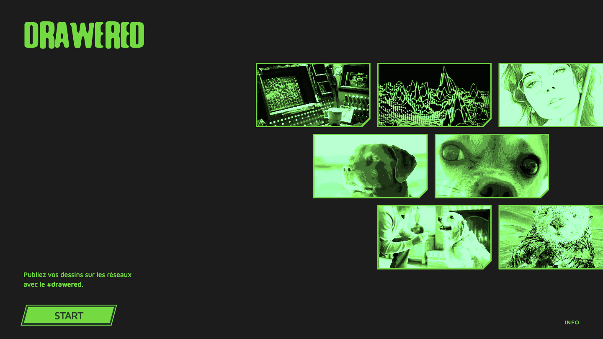
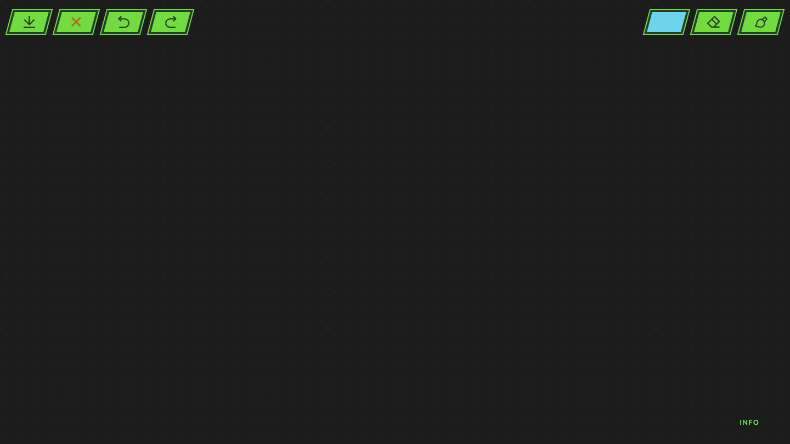

# Prompt 7 — 2026-06-12 08:52:02

## Prompt utilisateur (verbatim)

> /plan — lis les corrections dans instructions-7.md  → « c'est ok » (mode auto + archivage)

Contenu d'`instructions/instructions-7.md` (corrections demandées) :

**Welcome page**
- Les images doivent être **plus à droite** (là elles sont sur la gauche). Elles **peuvent
  déborder du cadre sur la droite**. Elles ne doivent **jamais passer sous le texte**.
- **Décaler vers la droite d'une image les deux images de la ligne du bas**.
- Les images doivent prendre **un peu moins de hauteur** : on avait dit 75 %, partons sur **60 %**.

**Global (alignements)**
- Une **ligne de base invisible tout en bas**, tout y est **collé contre** (alignement visuel).
- Mettre le **crédit uniquement sur la page info**, après START, en **lien vers le repo GitHub**
  du projet.
- Le bouton **START de l'accueil** doit être **collé à cette ligne de base** en bas.

## Résultat

- **Accueil galerie** (`style.css`) : repositionnée `right: -24px` (débordement à droite),
  hauteur réduite (`--card-h: 19vh` → 3 lignes ≈ **60 %** de la hauteur) ; **ligne du bas
  décalée d'une image** (`nth-child(3) margin-left = 1 carte + gap`) en plus de la brique
  (ligne paire = ½ carte) ; jamais sous le texte de gauche.
- **Ligne de base** : `bottom: 32px` commun ; **START** de l'accueil collé en bas
  (`.home-actions bottom: 32px`), INFO en bas, footer info aligné par le bas. Crédit **retiré
  de l'accueil**.
- **Crédit sur info** (`info.html`) : « 2026 – MU – 0.0.1 » placé **après START**, en **lien**
  vers `https://github.com/walliser-chas-us-em-terroir/Drawered_Design-Interface`.

Vérifié via Playwright (home, info) : galerie plus à droite et débordante, ligne du bas décalée,
~60 % de hauteur, START collé à la ligne de base, crédit déplacé sur info en lien GitHub.
Dessin (undo/redo/effacer/export) inchangé.

Fichiers : `style.css`, `index.html`, `info.html`.

## Captures

### Accueil

### Application

### Page info

