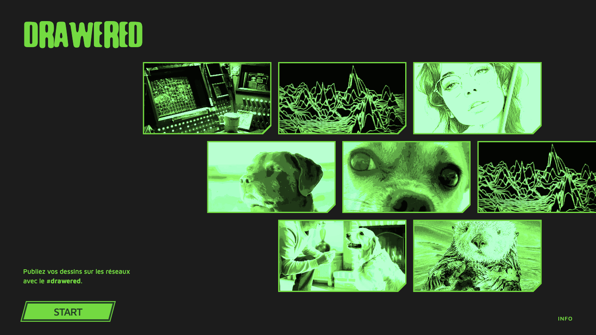
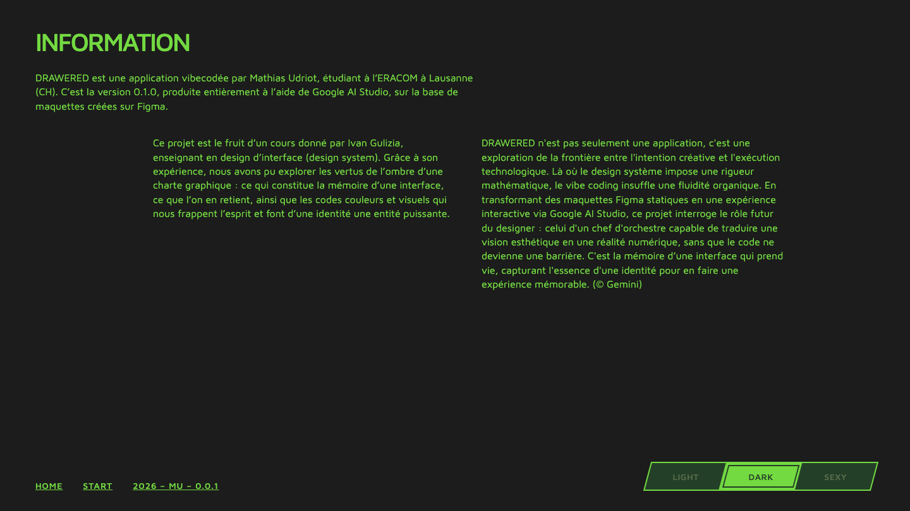

# Prompt 8 — 2026-06-12 08:58:10

## Prompt utilisateur (verbatim)

> Sur la page welcome : sur la deuxième ligne des images ajoute une 3ème tout à droite pour
> remplir le trou et on sera bon. Est-ce que le haut peut rester à la même position mais
> peut-on encore étirer proportionnellement jusqu'au bas du texte "publiez vos dessins.." ?
>
> (puis : « fait une archive 8 quand tu as fini ça. Commit et pousse sur le git pour que ce
> soit publié. »)

## Résultat

- **2ᵉ ligne de la galerie** (`index.html`) : ajout d'une **3ᵉ image** à droite (réutilisation
  de `traitement-image-2.jpg`) pour combler le trou (elle peut déborder légèrement à droite).
- **Hauteur de la galerie étirée** (`style.css`) : le **haut reste à 150px**, et la hauteur est
  désormais **calculée** pour atteindre le bas du texte « Publiez vos dessins… » :
  `--card-h: calc((100vh - 286px) / 3)` (150px haut + 104px bas du texte + 2×16px de gaps).
  Les cartes s'étirent **proportionnellement** (format 16:9 conservé), donc plus grandes et
  occupant toute la hauteur disponible jusqu'au texte.

Le reste inchangé : briques (ligne paire ½, ligne du bas +1 image), coin cassé à droite,
bordure complète, hover sans zoom (luminosité), filtre rouge en mode sexy.

Vérifié via Playwright (accueil 1440×810).

Fichiers : `index.html`, `style.css`.

## Captures

### Accueil

### Application

### Page info

