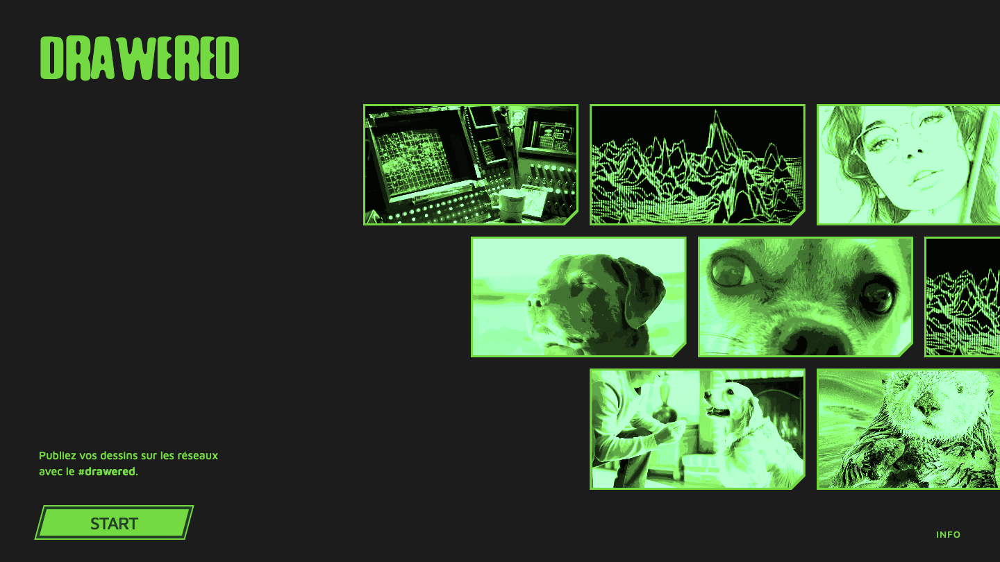

# Prompt 9 — 2026-06-12 09:01:34

## Prompt utilisateur (verbatim)

> les images de la page welcome doivent être bien plus sur la droite. ce n'est pas grave si
> c'est [le] vide [à gauche]. Mais ça doit dépasser sur la droite et non sur la gauche.

## Résultat

- **Galerie accueil** (`style.css`) : `right: -24px → -14vw` → la galerie est poussée **bien
  plus à droite**, **déborde sur la droite** (images coupées au bord droit), laisse du **vide à
  gauche**, et ne passe jamais sous le texte.

Fichiers : `style.css`.

## Captures

### Accueil

### Application

### Page info

